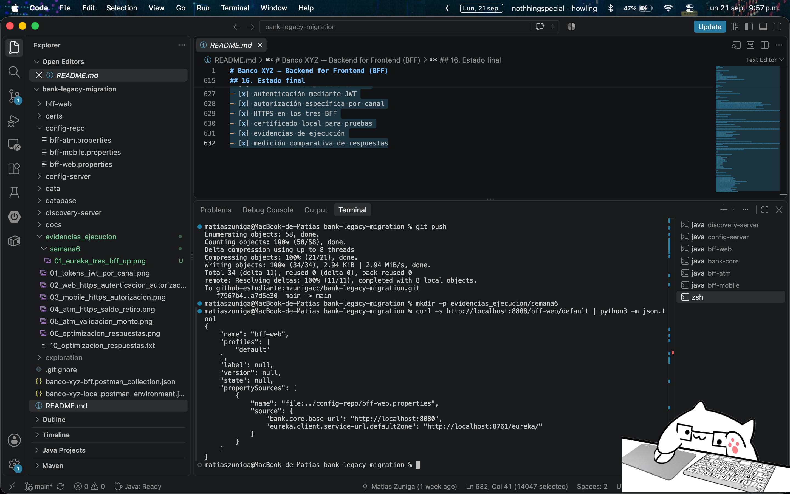
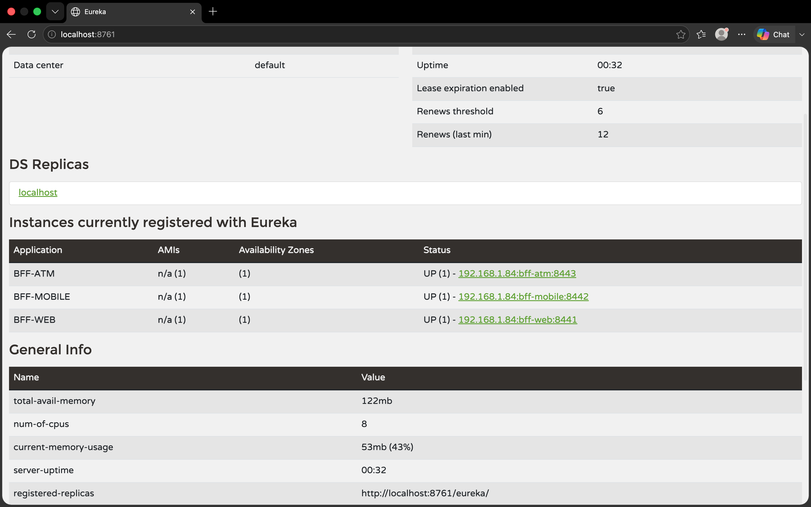
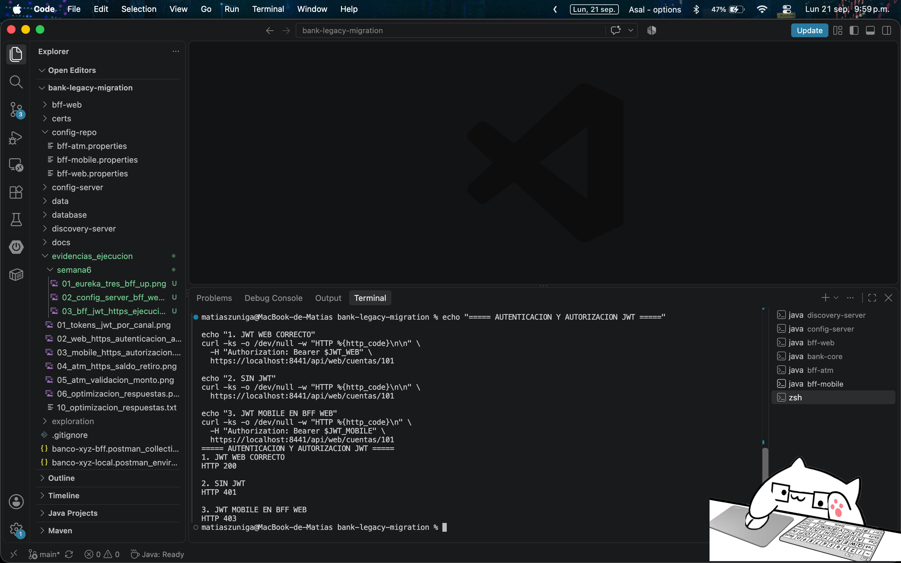
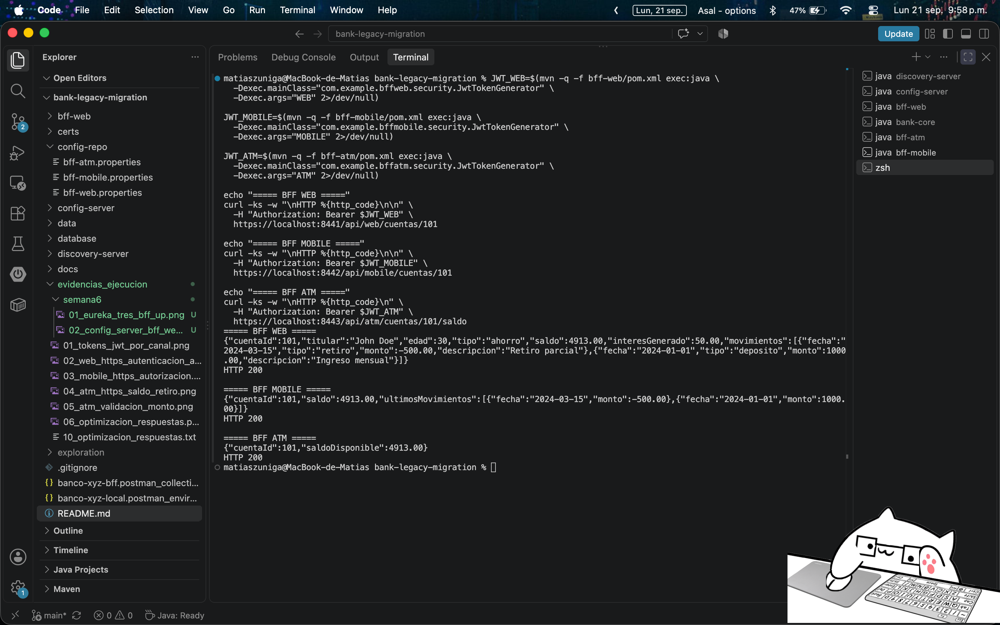

# Banco XYZ — Backend for Frontend (BFF)

Proyecto desarrollado para la asignatura **Desarrollo Backend III**, a partir del sistema de migración de datos legacy de Banco XYZ.

La solución implementa una arquitectura **Backend for Frontend (BFF)** con backends independientes para los canales **Web, Mobile y ATM**, complementada con componentes de **Spring Cloud** para configuración centralizada, descubrimiento de servicios y tolerancia a fallos.

---

## 1. Objetivo

Implementar una arquitectura de backend distribuida para Banco XYZ que permita:

- disponer de un BFF independiente para Web;
- disponer de un BFF independiente para Mobile;
- disponer de un BFF independiente para ATM;
- adaptar los datos entregados según las necesidades de cada canal;
- reducir información innecesaria en clientes con requerimientos más acotados;
- implementar autenticación y autorización mediante JWT;
- restringir cada BFF al rol correspondiente a su canal;
- proteger los BFF mediante HTTPS;
- centralizar configuraciones mediante Spring Cloud Config Server;
- registrar y descubrir microservicios mediante Eureka Service Discovery;
- incorporar tolerancia a fallos mediante Resilience4j Circuit Breaker y fallback;
- mantener la lógica de negocio y persistencia separada de la adaptación realizada por los BFF.

La arquitectura continúa el trabajo realizado durante las semanas anteriores, manteniendo además el procesamiento Batch como un componente independiente.

---

## 2. Arquitectura

La solución está compuesta por los siguientes componentes principales:

```text
                         ┌──────────────────────┐
                         │    Config Server     │
                         │        :8888         │
                         └──────────┬───────────┘
                                    │
                            configuración
                                    │
              ┌─────────────────────┼─────────────────────┐
              │                     │                     │
              ▼                     ▼                     ▼
       ┌─────────────┐       ┌─────────────┐       ┌─────────────┐
       │   BFF Web   │       │ BFF Mobile  │       │   BFF ATM   │
       │    :8441    │       │    :8442    │       │    :8443    │
       └──────┬──────┘       └──────┬──────┘       └──────┬──────┘
              │                     │                     │
              └─────────────────────┼─────────────────────┘
                                    │
                         Resilience4j / HTTP
                                    │
                                    ▼
                         ┌─────────────────────┐
                         │      Bank Core      │
                         │        :8080        │
                         │ negocio + JPA       │
                         └──────────┬──────────┘
                                    │
                                    ▼
                              PostgreSQL


              BFF Web ────────┐
              BFF Mobile ─────┼──▶ Eureka Discovery Server :8761
              BFF ATM ────────┘
```

Los tres BFF son aplicaciones Spring Boot independientes y no acceden directamente a PostgreSQL.

`bank-core` centraliza la lógica bancaria y el acceso a datos, mientras que cada BFF se concentra en adaptar la API a las necesidades de su canal.

`config-server` centraliza propiedades utilizadas por los BFF.

`discovery-server` implementa Eureka y permite registrar los tres BFF como instancias disponibles.

Los BFF incorporan Resilience4j para manejar de manera controlada fallos de comunicación con Bank Core.

El módulo `batch` permanece separado de la capa BFF y conserva la responsabilidad sobre los procesos Batch desarrollados durante las semanas anteriores.

---

## 3. Estructura del proyecto

```text
bank-legacy-migration/
│
├── batch/
│   └── procesos Spring Batch
│
├── bank-core/
│   └── lógica bancaria, persistencia JPA y API interna
│
├── bff-web/
│   └── Backend for Frontend para canal Web
│
├── bff-mobile/
│   └── Backend for Frontend para canal Mobile
│
├── bff-atm/
│   └── Backend for Frontend para canal ATM
│
├── config-server/
│   └── servidor de configuración centralizada
│
├── config-repo/
│   ├── bff-web.properties
│   ├── bff-mobile.properties
│   └── bff-atm.properties
│
├── discovery-server/
│   └── servidor Eureka Service Discovery
│
├── database/
│   └── scripts asociados a PostgreSQL
│
├── data/
├── docs/
├── exploration/
│
├── evidencias_ejecucion/
│   ├── evidencias de semanas anteriores
│   └── semana6/
│       ├── 01_eureka_tres_bff_up.png
│       ├── 02_config_server_bff_web.png
│       ├── 03_bff_jwt_https_ejecucion.png
│       ├── 04_autenticacion_autorizacion_jwt.png
│       └── 05_resilience4j_fallback_tres_bff.png
│
└── README.md
```

---

## 4. Responsabilidades por componente

### Bank Core

`bank-core` funciona como backend especializado y concentra:

- acceso a PostgreSQL mediante Spring Data JPA;
- consulta de cuentas;
- consulta de movimientos;
- lógica de retiros;
- actualización de saldos;
- registro persistente de retiros;
- manejo de errores asociados a operaciones bancarias.

Los BFF consumen esta API interna mediante HTTP y no contienen acceso directo a la base de datos.

### BFF Web

El canal Web entrega una representación más completa de la cuenta, adecuada para interfaces con mayor capacidad de visualización.

Incluye información como:

- identificador de cuenta;
- titular;
- edad;
- tipo de cuenta;
- saldo;
- interés generado;
- movimientos y sus descripciones.

### BFF Mobile

El canal Mobile reduce la cantidad de información enviada al cliente.

Entrega principalmente:

- identificador de cuenta;
- saldo;
- últimos movimientos.

Para disminuir el payload, la respuesta limita la información de movimientos a los datos esenciales requeridos por el cliente móvil.

### BFF ATM

El canal ATM utiliza respuestas mínimas orientadas a operaciones críticas.

Permite:

- consultar saldo disponible;
- realizar retiros.

La lógica bancaria del retiro permanece en `bank-core`; el BFF ATM se encarga de exponer y adaptar la operación para este canal.

### Config Server

`config-server` implementa Spring Cloud Config Server y centraliza propiedades que anteriormente se encontraban exclusivamente en la configuración local de cada BFF.

Las configuraciones se encuentran en:

```text
config-repo/
├── bff-web.properties
├── bff-mobile.properties
└── bff-atm.properties
```

Entre las propiedades centralizadas se encuentran:

```properties
bank.core.base-url=http://localhost:8080
eureka.client.service-url.defaultZone=http://localhost:8761/eureka/
```

El Config Server se encuentra disponible localmente en:

```text
http://localhost:8888
```

### Discovery Server

`discovery-server` implementa Eureka Service Discovery.

Se encuentra disponible en:

```text
http://localhost:8761
```

Los siguientes microservicios se registran en Eureka:

```text
BFF-WEB
BFF-MOBILE
BFF-ATM
```

Durante las pruebas se verificó que las tres instancias permanecieran registradas con estado `UP`.

---

## 5. Configuración centralizada

Los BFF utilizan Spring Cloud Config Client para obtener configuración desde `config-server`.

Cada aplicación mantiene su identidad mediante:

```properties
spring.application.name=bff-web
```

o su equivalente para Mobile y ATM.

La conexión con Config Server se realiza mediante:

```properties
spring.config.import=configserver:http://localhost:8888
```

Por ejemplo, la configuración centralizada de Web puede consultarse mediante:

```bash
curl http://localhost:8888/bff-web/default
```

La respuesta permite verificar que `bff-web` obtiene propiedades desde:

```text
config-repo/bff-web.properties
```

Evidencia:



---

## 6. Service Discovery

Los BFF utilizan Eureka Client y se registran en el Discovery Server.

La dirección de Eureka se encuentra centralizada mediante Config Server:

```properties
eureka.client.service-url.defaultZone=http://localhost:8761/eureka/
```

Durante la ejecución se verificó el registro simultáneo de:

```text
BFF-WEB       UP
BFF-MOBILE    UP
BFF-ATM       UP
```

Evidencia:



---

## 7. Tolerancia a fallos con Resilience4j

Los BFF incorporan **Resilience4j Circuit Breaker** para manejar fallos de comunicación con Bank Core.

La integración utiliza:

- `spring-cloud-starter-circuitbreaker-resilience4j`;
- `spring-boot-starter-aop`;
- anotaciones `@CircuitBreaker`;
- métodos de fallback.

Ejemplo conceptual:

```java
@CircuitBreaker(
    name = "bankCore",
    fallbackMethod = "getAccountFallback"
)
public Optional<CoreAccountResponse> getAccount(Long cuentaId) {
    // llamada a Bank Core
}
```

El fallback recibe los mismos parámetros del método protegido y un `Throwable` adicional.

Ante una falla de infraestructura, como Bank Core no disponible, el BFF evita propagar directamente la excepción de conexión y ejecuta el fallback correspondiente.

Durante las pruebas se detuvo `bank-core` manteniendo los tres BFF en ejecución.

El resultado observado fue:

```text
BFF Web       → HTTP 404 controlado
BFF Mobile    → HTTP 404 controlado
BFF ATM       → HTTP 404 controlado
```

En las consolas de los BFF se verificó además la ejecución del fallback ante `ResourceAccessException`.

La implementación conserva el tratamiento existente de errores funcionales. Por ejemplo, un `404` real proveniente de Bank Core continúa representando una cuenta inexistente.

En ATM, la operación transaccional de retiro conserva su manejo específico de errores y no simula una operación exitosa cuando Bank Core no está disponible.

Evidencia:


---

## 8. Seguridad

### HTTPS

Los tres BFF exponen sus APIs mediante HTTPS:

```text
Web     https://localhost:8441
Mobile  https://localhost:8442
ATM     https://localhost:8443
```

Para el entorno académico/local se utiliza un certificado autofirmado en formato PKCS12.

El certificado permite probar comunicación mediante TLS en los tres BFF. Al tratarse de un certificado autofirmado, herramientas como Postman o `curl` deben aceptar explícitamente el certificado local.

En `curl`, las pruebas locales utilizan:

```bash
-k
```

> El certificado y su configuración corresponden exclusivamente al entorno de desarrollo académico. En un entorno productivo se deben utilizar certificados emitidos y administrados mediante mecanismos apropiados para producción.

### JWT

La autenticación se implementa mediante JSON Web Tokens (JWT) firmados con HS256.

Cada token contiene un rol asociado al canal:

```text
ROLE_WEB
ROLE_MOBILE
ROLE_ATM
```

Cada BFF autoriza exclusivamente el rol correspondiente.

La matriz validada es:

| Solicitud | Resultado |
|---|---:|
| Token correspondiente al canal | `200 OK` |
| Sin token o token inválido | `401 Unauthorized` |
| Token válido de otro canal | `403 Forbidden` |

Durante la validación de Semana 6 se ejecutaron tres pruebas sobre BFF Web:

```text
JWT WEB correcto       → HTTP 200
Sin JWT                → HTTP 401
JWT MOBILE en BFF WEB  → HTTP 403
```

Evidencia:



---

## 9. Endpoints

### Web

#### Consultar cuenta

```http
GET /api/web/cuentas/{cuentaId}
```

Ejemplo:

```text
https://localhost:8441/api/web/cuentas/101
```

Requiere:

```text
ROLE_WEB
```

---

### Mobile

#### Consultar cuenta

```http
GET /api/mobile/cuentas/{cuentaId}
```

Ejemplo:

```text
https://localhost:8442/api/mobile/cuentas/101
```

Requiere:

```text
ROLE_MOBILE
```

---

### ATM

#### Consultar saldo

```http
GET /api/atm/cuentas/{cuentaId}/saldo
```

Ejemplo:

```text
https://localhost:8443/api/atm/cuentas/101/saldo
```

#### Realizar retiro

```http
POST /api/atm/cuentas/{cuentaId}/retiros
```

Ejemplo de body:

```json
{
  "monto": 10
}
```

Requiere:

```text
ROLE_ATM
```

---

## 10. Validación de operaciones ATM

Las solicitudes de retiro utilizan Jakarta Validation antes de enviar la operación a Bank Core.

Ejemplo:

```json
{
  "monto": 0
}
```

produce:

```text
400 Bad Request
```

con:

```json
{
  "error": "El monto debe ser mayor a cero"
}
```

También se manejan respuestas asociadas a situaciones como:

- cuenta inexistente;
- saldo insuficiente;
- monto inválido.

---

## 11. Optimización por canal

La estrategia BFF permite entregar representaciones diferentes de una misma cuenta según las necesidades del cliente.

Durante las pruebas locales se obtuvieron los siguientes tamaños de respuesta:

| Canal | HTTP | Tamaño de respuesta |
|---|---:|---:|
| Web | 200 | 294 bytes |
| Mobile | 200 | 133 bytes |
| ATM | 200 | 42 bytes |

En la ejecución registrada:

- Mobile redujo aproximadamente un **55 %** el tamaño respecto de Web.
- ATM redujo aproximadamente un **86 %** el tamaño respecto de Web.
- ATM redujo aproximadamente un **68 %** el tamaño respecto de Mobile.

Los tiempos observados durante una ejecución local fueron:

| Canal | Tiempo observado |
|---|---:|
| Web | 0.078947 s |
| Mobile | 0.050789 s |
| ATM | 0.029518 s |

Estos tiempos corresponden a una ejecución local y pueden variar entre ejecuciones. La diferencia de tamaño responde directamente al diseño de los DTO específicos de cada BFF.

---

## 12. Requisitos para ejecución

Para ejecutar el proyecto localmente se requiere:

- Java 17;
- Maven;
- PostgreSQL;
- base de datos `bank_legacy` configurada;
- puertos disponibles:
  - `8080` para Bank Core;
  - `8888` para Config Server;
  - `8761` para Eureka Discovery Server;
  - `8441` para BFF Web;
  - `8442` para BFF Mobile;
  - `8443` para BFF ATM.

---

## 13. Orden de ejecución

Debido a las dependencias entre componentes, se recomienda iniciar las aplicaciones en el siguiente orden:

```text
1. PostgreSQL
2. Config Server
3. Discovery Server
4. Bank Core
5. BFF Web
6. BFF Mobile
7. BFF ATM
```

Las aplicaciones deben ejecutarse en terminales independientes.

### 13.1 Config Server

```bash
cd config-server
mvn spring-boot:run
```

Disponible en:

```text
http://localhost:8888
```

### 13.2 Discovery Server

```bash
cd discovery-server
mvn spring-boot:run
```

Dashboard de Eureka:

```text
http://localhost:8761
```

### 13.3 Bank Core

```bash
cd bank-core
mvn spring-boot:run
```

Disponible en:

```text
http://localhost:8080
```

### 13.4 BFF Web

```bash
cd bff-web
mvn spring-boot:run
```

Disponible en:

```text
https://localhost:8441
```

### 13.5 BFF Mobile

```bash
cd bff-mobile
mvn spring-boot:run
```

Disponible en:

```text
https://localhost:8442
```

### 13.6 BFF ATM

```bash
cd bff-atm
mvn spring-boot:run
```

Disponible en:

```text
https://localhost:8443
```

---

## 14. Generación de tokens para pruebas

Para las pruebas locales se incluyen generadores de JWT asociados a cada BFF.

Desde la raíz del proyecto:

```bash
JWT_WEB=$(mvn -q -f bff-web/pom.xml exec:java \
  -Dexec.mainClass="com.example.bffweb.security.JwtTokenGenerator" \
  -Dexec.args="WEB" 2>/dev/null)

JWT_MOBILE=$(mvn -q -f bff-mobile/pom.xml exec:java \
  -Dexec.mainClass="com.example.bffmobile.security.JwtTokenGenerator" \
  -Dexec.args="MOBILE" 2>/dev/null)

JWT_ATM=$(mvn -q -f bff-atm/pom.xml exec:java \
  -Dexec.mainClass="com.example.bffatm.security.JwtTokenGenerator" \
  -Dexec.args="ATM" 2>/dev/null)
```

Los tokens utilizados para pruebas tienen una duración limitada.

---

## 15. Pruebas por terminal

### Config Server

```bash
curl -s http://localhost:8888/bff-web/default | python3 -m json.tool
```

Permite comprobar que Config Server entrega la configuración centralizada de `bff-web`.

### Web autorizado

```bash
curl -ki \
  -H "Authorization: Bearer $JWT_WEB" \
  https://localhost:8441/api/web/cuentas/101
```

Resultado esperado:

```text
HTTP/1.1 200
```

### Mobile autorizado

```bash
curl -ki \
  -H "Authorization: Bearer $JWT_MOBILE" \
  https://localhost:8442/api/mobile/cuentas/101
```

Resultado esperado:

```text
HTTP/1.1 200
```

### ATM autorizado

```bash
curl -ki \
  -H "Authorization: Bearer $JWT_ATM" \
  https://localhost:8443/api/atm/cuentas/101/saldo
```

Resultado esperado:

```text
HTTP/1.1 200
```

La ejecución conjunta de los tres canales se encuentra documentada en:



### Web sin autenticación

```bash
curl -ki \
  https://localhost:8441/api/web/cuentas/101
```

Resultado esperado:

```text
HTTP/1.1 401
```

### Web con token de otro canal

```bash
curl -ki \
  -H "Authorization: Bearer $JWT_MOBILE" \
  https://localhost:8441/api/web/cuentas/101
```

Resultado esperado:

```text
HTTP/1.1 403
```

### Prueba de tolerancia a fallos

Con los BFF activos y `bank-core` detenido temporalmente:

```bash
curl -ks -o /dev/null -w "HTTP %{http_code}\n" \
  -H "Authorization: Bearer $JWT_WEB" \
  https://localhost:8441/api/web/cuentas/101
```

El fallback permite entregar una respuesta controlada en lugar de propagar directamente el error de conexión.

---

## 16. Evidencias de ejecución — Semana 6

Las evidencias asociadas a la implementación de Spring Cloud, seguridad y tolerancia a fallos se encuentran en:

```text
evidencias_ejecucion/semana6/
```

| Archivo | Validación |
|---|---|
| `01_eureka_tres_bff_up.png` | Registro simultáneo de BFF Web, Mobile y ATM en Eureka con estado `UP` |
| `02_config_server_bff_web.png` | Config Server entregando configuración centralizada a BFF Web |
| `03_bff_jwt_https_ejecucion.png` | Ejecución funcional de Web, Mobile y ATM mediante HTTPS y JWT |
| `04_autenticacion_autorizacion_jwt.png` | Autenticación y autorización: `200`, `401` y `403` |
| `05_resilience4j_fallback_tres_bff.png` | Respuesta controlada de los tres BFF con Bank Core no disponible |

Estas evidencias complementan las pruebas y documentación desarrolladas durante las semanas anteriores.

---

## 17. Decisiones de diseño

### BFF independientes

Cada canal dispone de su propia aplicación Spring Boot.

Esto permite modificar, desplegar o escalar un BFF sin requerir que los otros canales compartan necesariamente el mismo ciclo de despliegue.

### Separación entre BFF y negocio

Los BFF no acceden directamente a PostgreSQL.

La persistencia y las reglas bancarias se encuentran centralizadas en `bank-core`, mientras que los BFF se concentran en:

- exposición de endpoints por canal;
- transformación de respuestas;
- DTO específicos;
- validación de entrada cuando corresponde;
- autenticación y autorización;
- comunicación con Bank Core;
- tolerancia a fallos en llamadas externas.

### Configuración centralizada

Las propiedades compartidas o dependientes del entorno se administran mediante Config Server y `config-repo`.

Esto evita depender exclusivamente de configuraciones locales independientes en cada BFF y permite centralizar cambios de infraestructura.

### Service Discovery

Los tres BFF se registran en Eureka.

Esto permite disponer de un registro centralizado de las instancias activas y establece la base para una arquitectura de microservicios con descubrimiento dinámico.

### Tolerancia a fallos

Las consultas hacia Bank Core protegidas con Resilience4j utilizan Circuit Breaker y métodos fallback.

El objetivo es evitar que una indisponibilidad de Bank Core provoque directamente una excepción no controlada en los BFF.

Los fallbacks utilizados en las consultas devuelven respuestas degradadas y controladas.

### Operaciones transaccionales

La operación de retiro de ATM conserva su manejo específico de errores.

No se utiliza un fallback que simule un retiro exitoso cuando Bank Core no está disponible, evitando representar como realizada una operación que no pudo confirmarse.

### Seguridad uniforme

Los tres BFF utilizan el mismo mecanismo general de autenticación mediante JWT y comunicación HTTPS, pero aplican autorización específica según el rol de cada canal.

---

## 18. Tecnologías utilizadas

- Java 17
- Spring Boot 3.5.10
- Spring Web
- Spring Security
- Spring Data JPA
- Spring Cloud 2025.0.0
- Spring Cloud Config Server
- Spring Cloud Config Client
- Netflix Eureka Server
- Netflix Eureka Client
- Resilience4j
- Spring AOP
- Jakarta Validation
- JWT / JJWT
- PostgreSQL
- Maven
- HTTPS / TLS
- Git y GitHub
- curl y Postman para pruebas

---

## 19. Estado final

La implementación contempla:

- [x] BFF independiente para Web
- [x] BFF independiente para Mobile
- [x] BFF independiente para ATM
- [x] respuestas adaptadas por canal
- [x] reducción de payload según necesidades del cliente
- [x] Bank Core separado de los BFF
- [x] persistencia mediante Spring Data JPA
- [x] validación de operaciones ATM
- [x] autenticación mediante JWT
- [x] autorización específica por canal
- [x] HTTPS en los tres BFF
- [x] certificado local para pruebas
- [x] Config Server funcional
- [x] configuración centralizada mediante `config-repo`
- [x] Eureka Discovery Server funcional
- [x] BFF Web registrado en Eureka
- [x] BFF Mobile registrado en Eureka
- [x] BFF ATM registrado en Eureka
- [x] Circuit Breaker con Resilience4j
- [x] fallback ante indisponibilidad de Bank Core
- [x] tolerancia a fallos validada en los tres BFF
- [x] evidencias de ejecución de Semana 6