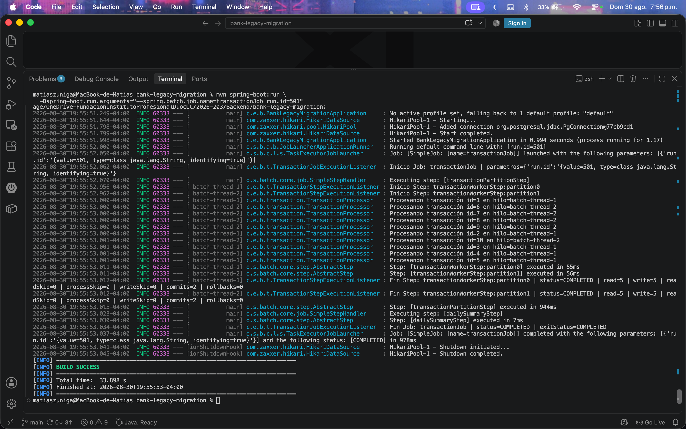
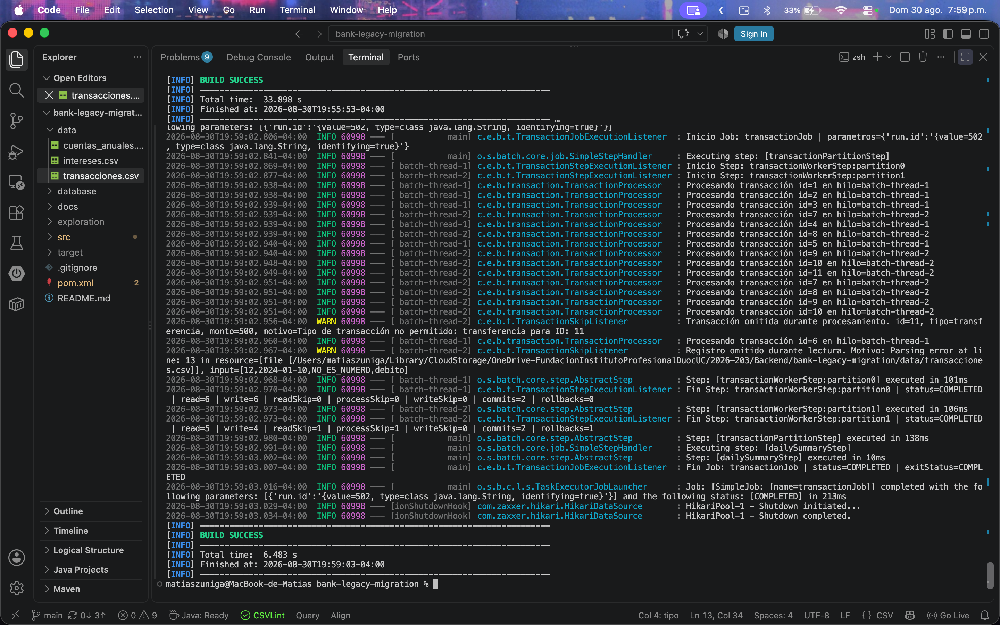
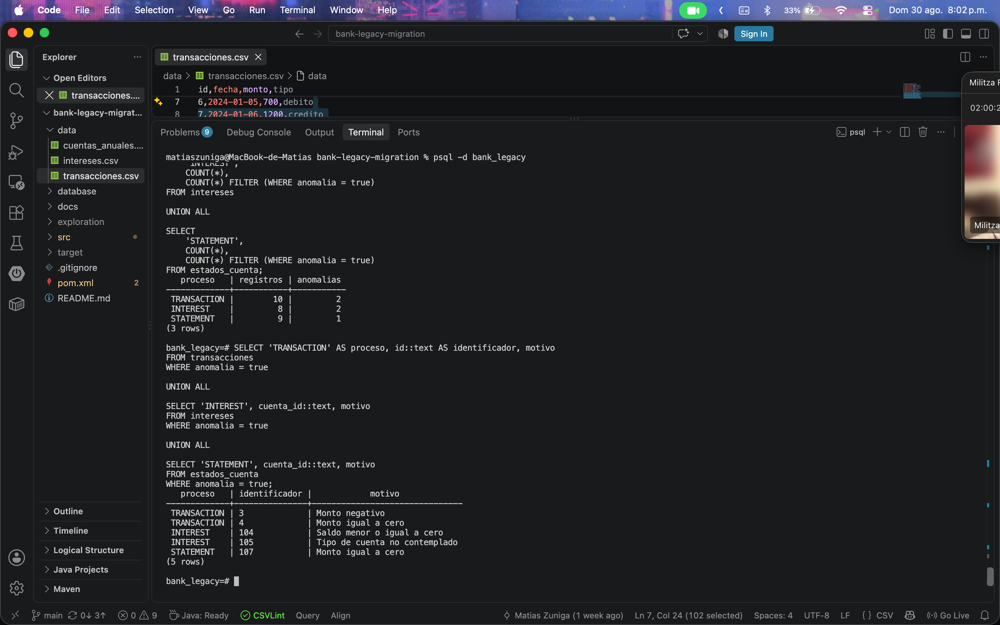
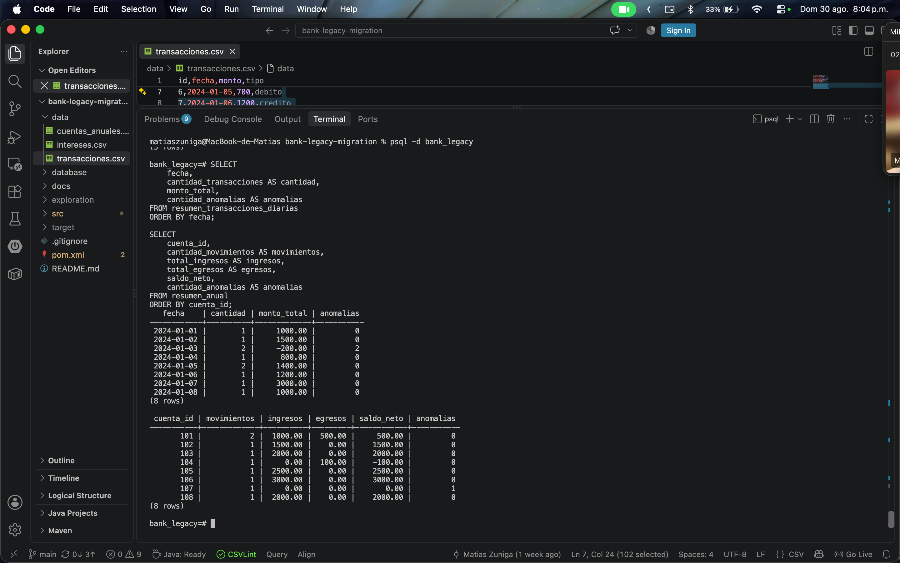
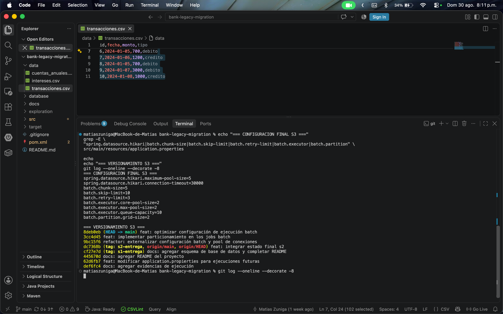
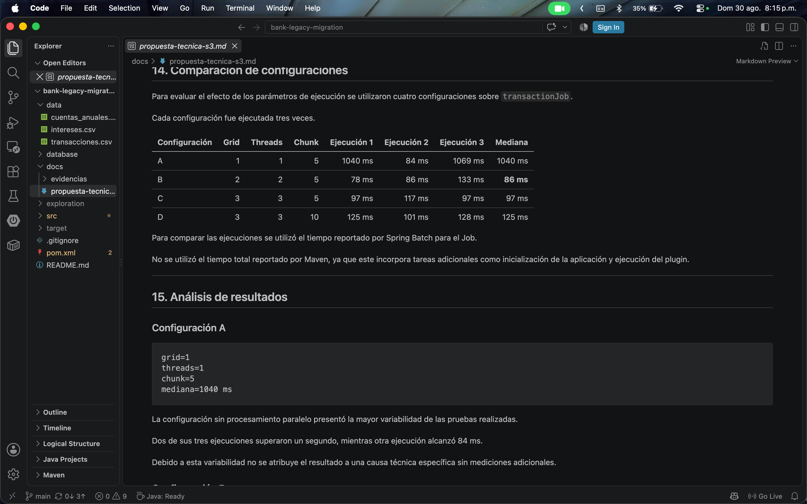

# Bank Legacy Migration - Semana 3

Proyecto desarrollado con **Java, Spring Boot, Spring Batch y PostgreSQL** para procesar información proveniente de archivos CSV de un sistema bancario legacy.

Esta versión corresponde a la evolución del proyecto desarrollado durante las Semanas 1 y 2. Mantiene los tres procesos batch existentes e incorpora una arquitectura de **procesamiento particionado**, configuración externalizada y pruebas comparativas de rendimiento.

La solución implementa:

- procesamiento mediante Reader → Processor → Writer;
- persistencia relacional en PostgreSQL;
- validación y clasificación de anomalías;
- políticas específicas de `skip` y `retry`;
- excepciones personalizadas y listeners;
- procesamiento por chunks;
- particionamiento de archivos mediante `ExecutionContext`;
- ejecución paralela mediante un `TaskExecutor`;
- configuración externalizada de chunks, particiones, threads, skip y retry;
- pool de conexiones HikariCP;
- persistencia idempotente;
- comparación experimental de distintas configuraciones de ejecución.

La configuración final utilizada para los datos actuales es:

```text
grid-size = 2
threads   = 2
chunk     = 5
```

Esta configuración fue seleccionada a partir de ejecuciones comparativas y no representa un valor universal: los parámetros pueden ajustarse según el volumen de datos y los recursos disponibles.

---

## Tecnologías utilizadas

- Java 17
- Spring Boot 3
- Spring Batch
- PostgreSQL
- Maven
- HikariCP
- Git / GitHub

---

## Estructura general

```text
bank-legacy-migration/
├── data/
│   ├── transacciones.csv
│   ├── intereses.csv
│   └── cuentas_anuales.csv
│
├── database/
│   └── schema.sql
│
├── docs/
│   ├── propuesta-tecnica-s3.md
│   └── evidencias/
│       ├── transaction-job.png
│       ├── transaction-skip.png
│       ├── interest-job.png
│       └── statement-job.png
│
├── src/main/java/com/example/banklegacymigration/
│   ├── config/
│   ├── transaction/
│   ├── interest/
│   └── statement/
│
├── src/main/resources/
│   └── application.properties
│
├── pom.xml
└── README.md
```

Los tres dominios mantienen el flujo principal:

```text
Reader → Processor → Writer
```

En Semana 3 este procesamiento se ejecuta dentro de workers independientes creados mediante particionamiento:

```text
CSV
 │
 ▼
Partitioner
 │
 ├── partition0 → ExecutionContext(start, end)
 └── partition1 → ExecutionContext(start, end)
          │
          ▼
     TaskExecutor
          │
     ┌────┴────┐
     ▼         ▼
 Worker 0    Worker 1
     │         │
     ▼         ▼
 Reader      Reader
     │         │
 Processor   Processor
     │         │
 Writer      Writer
     └────┬────┘
          ▼
      PostgreSQL
```

Cada partición utiliza su propia instancia `@StepScope` del `FlatFileItemReader`. Los límites `start` y `end` son recibidos desde el `ExecutionContext`, evitando compartir un Reader entre múltiples hilos.

---

## Procesos implementados

### Transaction Job

Procesa:

```text
data/transacciones.csv
```

El Job:

- valida identificadores y tipos de transacción;
- conserva montos negativos o iguales a cero como anomalías procesables;
- omite registros inválidos mediante excepciones específicas;
- persiste las transacciones válidas;
- genera un resumen diario mediante `dailySummaryStep`.

Flujo:

```text
transactionPartitionStep
        │
        ├── transactionWorkerStep:partition0
        └── transactionWorkerStep:partition1
        │
        ▼
dailySummaryStep
```

La ejecución final sobre los datos originales procesó los 10 registros mediante dos particiones de 5 registros cada una.

Los registros con monto negativo o igual a cero se conservan como anomalías porque continúan siendo transacciones interpretables desde el punto de vista del dominio.

---

### Interest Job

Procesa:

```text
data/intereses.csv
```

Calcula intereses y saldo final para cuentas de ahorro y préstamos.

Tasas utilizadas:

- ahorro: 1%;
- préstamo: 2%.

Los tipos de cuenta conocidos pero no contemplados para cálculo, como `hipoteca`, se conservan como anomalías.

El proceso utiliza la misma arquitectura particionada:

```text
interestPartitionStep
        │
        ├── interestWorkerStep:partition0
        └── interestWorkerStep:partition1
```

Cada worker ejecuta independientemente las etapas Reader → Processor → Writer sobre el rango de registros que le corresponde.

---

### Statement Job

Procesa:

```text
data/cuentas_anuales.csv
```

Clasifica los movimientos como:

```text
INGRESO
EGRESO
SIN_MOVIMIENTO
```

y genera posteriormente un resumen anual por cuenta.

Flujo:

```text
statementPartitionStep
        │
        ├── statementWorkerStep:partition0
        └── statementWorkerStep:partition1
        │
        ▼
annualSummaryStep
```

El resumen incluye:

- cantidad de movimientos;
- total de ingresos;
- total de egresos;
- saldo neto;
- cantidad de anomalías.

---

## Evolución del proyecto

### Semana 1

La primera versión implementó los tres procesos batch mediante la arquitectura:

```text
Reader → Processor → Writer
```

junto con persistencia en PostgreSQL y generación de resúmenes.

### Semana 2

La segunda versión incorporó:

- excepciones personalizadas;
- políticas específicas de `skip`;
- políticas de `retry`;
- listeners;
- métricas de ejecución;
- procesamiento mediante chunks;
- ejecución concurrente mediante múltiples hilos.

También se corrigieron inconsistencias detectadas en la primera versión.

### Semana 3

La tercera versión reemplaza la lectura concurrente compartida por una arquitectura de **particionamiento**.

Cada partición posee:

- su propio Reader;
- su propio rango de registros;
- su propio contexto de ejecución;
- métricas independientes;
- políticas de tolerancia a fallos independientes.

Además, los parámetros principales de ejecución fueron externalizados y se realizaron pruebas comparativas para seleccionar una configuración adecuada al volumen de datos actual.

---

## Correcciones de consistencia

### Consistencia entre modelo y esquema

Se alinearon las columnas utilizadas por los Writers con `database/schema.sql`, incorporando campos requeridos como:

```text
edad
descripcion
```

### Restricciones de unicidad

Se revisaron las restricciones utilizadas por:

```sql
ON CONFLICT
```

para que coincidan con claves primarias o restricciones `UNIQUE` reales en PostgreSQL.

Esto permite mantener la estrategia de persistencia idempotente sin producir conflictos inválidos.

### Finalización de Tasklets

Los tasklets de resumen finalizan explícitamente con:

```java
RepeatStatus.FINISHED
```

---

## Manejo de errores y excepciones

La solución diferencia entre tres tipos principales de situaciones:

```text
Anomalía procesable
→ se conserva y marca

Dato inválido
→ SKIP

Error transitorio de infraestructura
→ RETRY
```

Esta distinción evita aplicar una política general a errores que poseen causas y tratamientos diferentes.

### Anomalías procesables

Una anomalía no necesariamente implica descartar el registro.

Por ejemplo:

```text
monto negativo
monto igual a cero
tipo de cuenta conocido pero no contemplado
```

pueden conservarse en la base de datos junto con:

```text
anomalia = true
motivo   = descripción del problema
```

Esto permite mantener trazabilidad sobre los datos recibidos.

### Excepciones personalizadas

Cada dominio posee una excepción propia de validación:

```text
InvalidTransactionException
InvalidInterestAccountException
InvalidStatementException
```

Esto permite distinguir errores de negocio de errores inesperados o de infraestructura.

---

## Políticas de Skip

Se utilizan omisiones controladas para errores identificables que impiden procesar correctamente un registro.

Por ejemplo:

```java
.skip(InvalidTransactionException.class)
.skip(FlatFileParseException.class)
.skipLimit(skipLimit)
```

El límite se encuentra externalizado:

```properties
batch.skip-limit=10
```

### Error de negocio

Se realizó una prueba controlada incorporando temporalmente una transacción con:

```text
tipo = transferencia
```

El `TransactionProcessor` generó `InvalidTransactionException`.

La ejecución registró:

```text
processSkip=1
```

y el Job terminó:

```text
status=COMPLETED
```

### Error de parsing

También se probó temporalmente un registro con un monto no numérico:

```text
12,2024-01-10,NO_ES_NUMERO,debito
```

El Reader produjo un `FlatFileParseException`.

La ejecución registró:

```text
readSkip=1
```

sin interrumpir el Job.

En la prueba combinada se obtuvo:

```text
partition0
read=6
write=6
readSkip=0
processSkip=0

partition1
read=5
write=4
readSkip=1
processSkip=1

Job
status=COMPLETED
```

De esta forma se verificó la continuidad del procesamiento frente a errores tanto de lectura como de negocio.

---

## Política de Retry

Los errores transitorios de acceso a datos pueden reintentarse mediante:

```java
.retry(TransientDataAccessException.class)
.retryLimit(retryLimit)
```

El límite también se encuentra externalizado:

```properties
batch.retry-limit=3
```

La política de `retry` se reserva para errores potencialmente temporales de infraestructura.

De esta forma:

```text
error permanente del dato
→ skip

error transitorio de acceso a datos
→ retry
```

No se utiliza `retry` para intentar nuevamente registros que ya se sabe que son inválidos.

---

## Listeners y trazabilidad

Cada Job incorpora listeners para registrar diferentes niveles del procesamiento.

### JobExecutionListener

Registra:

```text
inicio del Job
parámetros
estado final
exit status
```

### StepExecutionListener

Registra métricas como:

```text
read
write
readSkip
processSkip
writeSkip
commits
rollbacks
```

En una ejecución particionada estas métricas permiten observar independientemente el comportamiento de cada worker.

### SkipListener

Registra información de los registros omitidos y el motivo del rechazo.

Por ejemplo:

```text
id
tipo
monto
fase del procesamiento
motivo
```

Esto permite diferenciar si el error ocurrió durante lectura, procesamiento o escritura.

---

## Procesamiento particionado

Los tres Jobs utilizan particionamiento para distribuir los registros de entrada entre múltiples workers.

Cada dominio posee un `Partitioner` encargado de:

1. contar los registros disponibles en el CSV;
2. dividir dinámicamente el total según `grid-size`;
3. calcular los límites de cada partición;
4. crear un `ExecutionContext` con `start` y `end`.

Conceptualmente:

```text
10 registros
grid-size = 2

partition0 → start=0 → end=5
partition1 → start=5 → end=10
```

Si el número de registros no es divisible exactamente por el número de particiones, los registros restantes se distribuyen entre las primeras particiones.

---

## Readers independientes por partición

Los Readers se encuentran definidos con `@StepScope` y reciben sus límites desde el contexto de ejecución:

```java
@Value("#{stepExecutionContext['start']}")
Integer start

@Value("#{stepExecutionContext['end']}")
Integer end
```

Estos valores se utilizan para limitar el rango leído mediante:

```java
.currentItemCount(start)
.maxItemCount(end)
```

Por lo tanto, cada worker posee su propia instancia de `FlatFileItemReader`.

Esto evita compartir el estado interno de un único Reader entre múltiples hilos.

---

## TaskExecutor

La ejecución paralela se realiza en el nivel de las particiones mediante un `ThreadPoolTaskExecutor`.

El manager distribuye las particiones entre los threads disponibles:

```text
Partition Manager
       │
       ▼
TaskExecutor
       │
 ┌─────┴─────┐
 ▼           ▼
Worker 0   Worker 1
```

No se configura un `TaskExecutor` adicional dentro de los workers, evitando paralelismo anidado.

---

## Configuración externalizada

Los principales parámetros de procesamiento pueden modificarse desde:

```text
src/main/resources/application.properties
```

sin necesidad de recompilar el proyecto.

Configuración final:

```properties
batch.chunk-size=5
batch.skip-limit=10
batch.retry-limit=3

batch.executor.core-pool-size=2
batch.executor.max-pool-size=2
batch.executor.queue-capacity=10

batch.partition.grid-size=2
```

---

## Pool de conexiones

La conexión con PostgreSQL utiliza HikariCP.

La configuración incluye:

```properties
spring.datasource.hikari.maximum-pool-size=5
spring.datasource.hikari.connection-timeout=30000
```

El tamaño máximo del pool es superior al número de workers configurados actualmente, permitiendo atender las conexiones utilizadas por el procesamiento paralelo y otras operaciones del Job sin igualar artificialmente el número de conexiones al número de threads.

---

## Comparación de configuraciones

Para evaluar el comportamiento del procesamiento particionado se probaron cuatro configuraciones sobre `transactionJob`.

Cada configuración fue ejecutada tres veces.

| Configuración | Grid | Threads | Chunk | Ejecución 1 | Ejecución 2 | Ejecución 3 | Mediana |
|---|---:|---:|---:|---:|---:|---:|---:|
| A | 1 | 1 | 5 | 1040 ms | 84 ms | 1069 ms | 1040 ms |
| B | 2 | 2 | 5 | 78 ms | 86 ms | 133 ms | **86 ms** |
| C | 3 | 3 | 5 | 97 ms | 117 ms | 97 ms | 97 ms |
| D | 3 | 3 | 10 | 125 ms | 101 ms | 128 ms | 125 ms |

Para la comparación se utilizó el tiempo reportado por Spring Batch para la ejecución del Job, evitando utilizar el tiempo total de Maven, que también incluye inicialización y otras tareas externas al procesamiento batch.

### Resultado

La configuración B obtuvo la menor mediana:

```text
grid-size = 2
threads   = 2
chunk     = 5

mediana = 86 ms
```

Por esta razón fue seleccionada como configuración predeterminada.

Los resultados no implican que dos threads sean universalmente superiores a tres.

El archivo utilizado en la prueba contiene pocos registros, por lo que aumentar el número de particiones también aumenta proporcionalmente el costo de coordinación. Con volúmenes mayores, la relación entre cantidad de workers, tamaño del chunk y tiempo de ejecución puede cambiar.

La configuración A presentó además una mayor variabilidad en el entorno de prueba, mientras que las configuraciones B y C presentaron tiempos más consistentes.

---

## Persistencia e idempotencia

Los resultados son almacenados en PostgreSQL.

Las tablas de detalle utilizan restricciones relacionales junto con:

```sql
ON CONFLICT (...) DO NOTHING
```

para evitar duplicados durante reejecuciones.

Las tablas derivadas utilizan:

```sql
ON CONFLICT (...) DO UPDATE
```

permitiendo recalcular los resúmenes.

Durante la validación final, `transactionJob` fue ejecutado nuevamente sobre registros ya persistidos y la tabla mantuvo exactamente los 10 registros originales, sin generar duplicados.

No se utilizan mecanismos adicionales de hashing o deduplicación.

---

## Configuración de PostgreSQL

Crear la base de datos:

```bash
createdb bank_legacy
```

Crear las tablas:

```bash
psql bank_legacy < database/schema.sql
```

La conexión se encuentra configurada en:

```text
src/main/resources/application.properties
```

Spring Batch inicializa además sus tablas de metadatos mediante:

```properties
spring.batch.jdbc.initialize-schema=always
```

---

## Ejecución

Los Jobs pueden seleccionarse desde la línea de comandos mediante:

```text
--spring.batch.job.name
```

### Transaction Job

```bash
mvn spring-boot:run \
  -Dspring-boot.run.arguments="--spring.batch.job.name=transactionJob run.id=1"
```

### Interest Job

```bash
mvn spring-boot:run \
  -Dspring-boot.run.arguments="--spring.batch.job.name=interestJob run.id=1"
```

### Statement Job

```bash
mvn spring-boot:run \
  -Dspring-boot.run.arguments="--spring.batch.job.name=statementJob run.id=1"
```

El parámetro `run.id` se utiliza como parámetro identificador para crear nuevas instancias de ejecución durante las pruebas.

Debe utilizarse un valor diferente cuando se desea iniciar una nueva instancia con los mismos parámetros restantes.

---

## Sobrescritura de parámetros

Los parámetros externalizados pueden modificarse temporalmente desde la línea de comandos.

Por ejemplo:

```bash
mvn spring-boot:run \
  -Dspring-boot.run.arguments="--spring.batch.job.name=transactionJob --batch.partition.grid-size=3 --batch.executor.core-pool-size=3 --batch.executor.max-pool-size=3 --batch.chunk-size=5 run.id=100"
```

Esto permite realizar experimentos de rendimiento sin modificar permanentemente `application.properties`.

---

## Evidencias

Las evidencias de Semana 3 se encuentran en:

```text
docs/evidencias/
```

Se priorizaron capturas que permitieran demostrar varios criterios simultáneamente, evitando evidencia redundante.

### S3-01 — Ejecución particionada de Transaction Job

La ejecución final de `transactionJob` utiliza:

```text
grid-size = 2
threads   = 2
chunk     = 5
```

La evidencia muestra:

- `transactionPartitionStep`;
- `partition0` y `partition1`;
- ejecución en `batch-thread-1` y `batch-thread-2`;
- distribución de 5 registros por partición;
- métricas `read=5` y `write=5`;
- ausencia de skips y rollbacks;
- ejecución de `dailySummaryStep`;
- Job finalizado con estado `COMPLETED`.



### S3-02 — Tolerancia a fallos

Se incorporaron temporalmente dos registros inválidos para probar dos escenarios diferentes:

```text
tipo no permitido
→ processSkip

monto no numérico
→ readSkip
```

La evidencia muestra los mensajes del `SkipListener`, las métricas de ambas particiones y la continuidad del Job hasta finalizar correctamente.

En la partición afectada se registró:

```text
read=5
write=4
readSkip=1
processSkip=1
rollbacks=1
```

mientras el Job terminó con:

```text
status=COMPLETED
```



### S3-03 — Persistencia y anomalías

La consulta conjunta en PostgreSQL muestra los resultados persistidos por los tres procesos:

```text
TRANSACTION → 10 registros → 2 anomalías
INTEREST    →  8 registros → 2 anomalías
STATEMENT   →  9 registros → 1 anomalía
```

También se muestran los registros afectados y sus respectivos motivos.



### S3-04 — Resúmenes derivados

La evidencia muestra:

- `resumen_transacciones_diarias`;
- `resumen_anual`.

Esto permite comprobar que los Steps posteriores al procesamiento de detalle generan correctamente las agregaciones esperadas.



### S3-05 — Configuración y versionamiento

La evidencia muestra la configuración final externalizada:

```text
Hikari maximum pool size = 5
chunk                    = 5
skip limit               = 10
retry limit              = 3
core threads             = 2
max threads              = 2
grid-size                = 2
```

También se observa el versionamiento de las principales decisiones de Semana 3:

```text
feat: optimizar configuración de ejecución batch
feat: implementar particionamiento en los jobs batch
refactor: externalizar configuración batch y pool de conexiones
```



### S3-06 — Comparación de rendimiento

Se probaron cuatro configuraciones diferentes sobre `transactionJob`, realizando tres ejecuciones por configuración.

La evidencia muestra la tabla comparativa completa y la mediana obtenida en cada caso.

La configuración seleccionada fue:

```text
grid-size = 2
threads   = 2
chunk     = 5

mediana = 86 ms
```



### Ejecución normal

Los logs permiten observar:

```text
nombre de la partición
thread utilizado
cantidad de registros leídos
cantidad de registros escritos
skips
commits
rollbacks
estado final
```

La ejecución final de `transactionJob` con la configuración seleccionada distribuyó los 10 registros de entrada de la siguiente forma:

```text
partition0
status=COMPLETED
read=5
write=5

partition1
status=COMPLETED
read=5
write=5

Job
status=COMPLETED
```

### Tolerancia a fallos

Se realizaron dos modificaciones temporales sobre el archivo de transacciones:

```text
tipo no permitido
→ processSkip

monto no numérico
→ readSkip
```

Ambos errores fueron controlados por las políticas configuradas y el Job terminó correctamente.

Los archivos originales fueron restaurados después de las pruebas.

### Resultados persistidos

La validación final en PostgreSQL confirmó:

```text
transacciones
→ 10 registros originales persistidos

intereses
→ 8 cuentas procesadas

estados_cuenta
→ 9 movimientos procesados

resumen_anual
→ 8 cuentas resumidas
```

Las anomalías identificadas por los Processors se conservaron junto con su motivo correspondiente.

Las capturas y evidencias complementarias se encuentran en `docs/evidencias/`.

---

## Propuesta técnica

El análisis detallado de la arquitectura, las decisiones de configuración, las pruebas comparativas y las conclusiones de Semana 3 se documenta en:

```text
docs/propuesta-tecnica-s3.md
```

---

## Resultado

La versión de Semana 3 mantiene las funcionalidades construidas durante las semanas anteriores y evoluciona la estrategia de escalamiento hacia un modelo particionado.

Se implementaron:

```text
✓ tres Jobs batch funcionales
✓ Reader → Processor → Writer
✓ particionamiento dinámico de archivos
✓ ExecutionContext por partición
✓ Readers independientes con @StepScope
✓ ejecución paralela mediante TaskExecutor
✓ chunks configurables
✓ número de threads configurable
✓ grid-size configurable
✓ HikariCP configurado explícitamente
✓ excepciones personalizadas
✓ skip específico para errores de negocio
✓ skip para errores de parsing
✓ retry para errores transitorios
✓ SkipListener
✓ StepExecutionListener
✓ JobExecutionListener
✓ logs y métricas por partición
✓ pruebas comparativas de rendimiento
✓ configuración final seleccionada mediante evidencia
✓ persistencia idempotente
✓ resúmenes diarios y anuales
```

La configuración predeterminada final es:

```text
grid-size = 2
threads   = 2
chunk     = 5
```

Esta configuración corresponde al mejor resultado observado para el conjunto de datos utilizado en las pruebas y permanece externalizada para permitir ajustes frente a otros volúmenes o condiciones de ejecución.