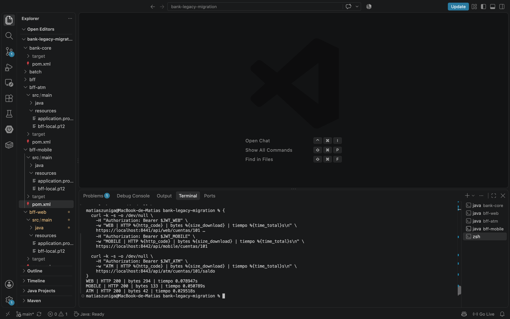
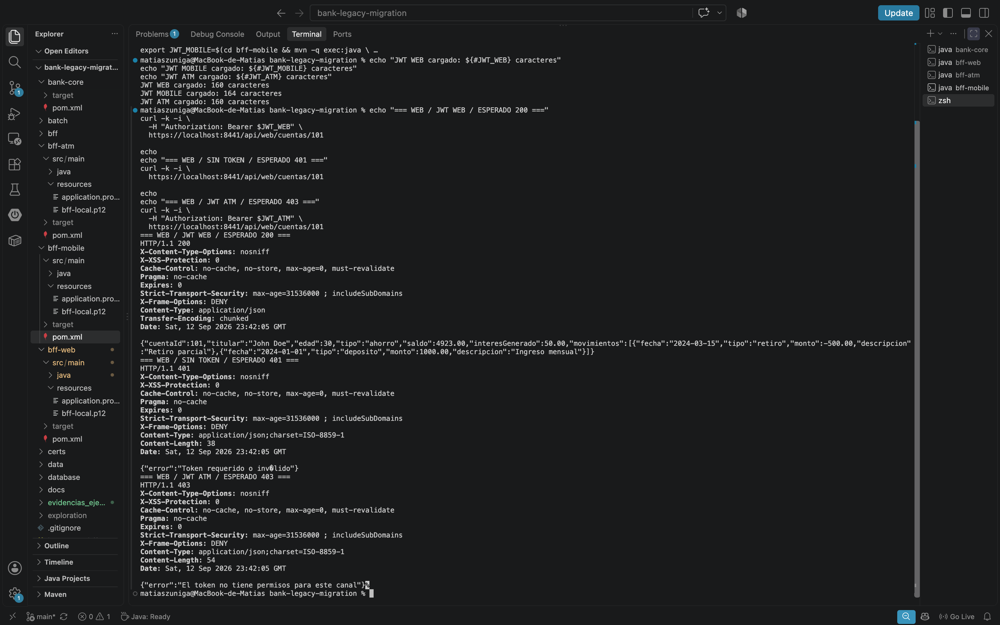
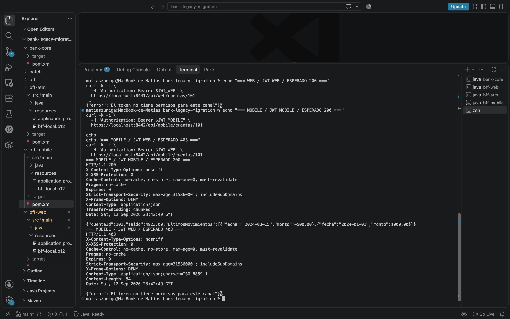
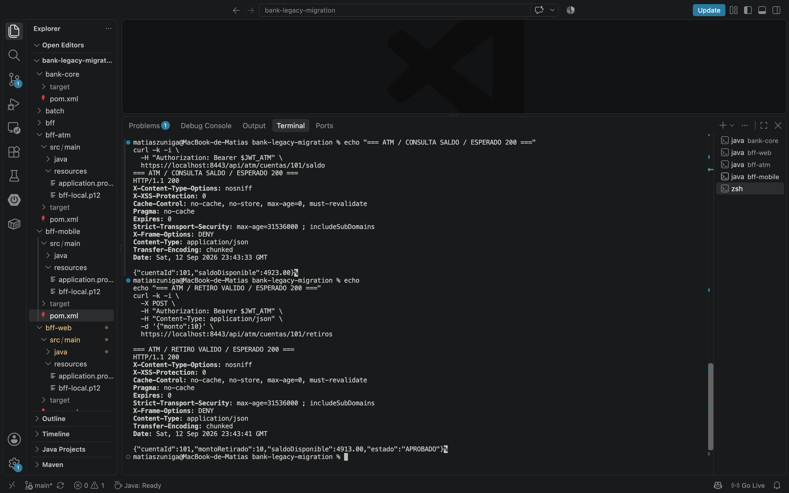
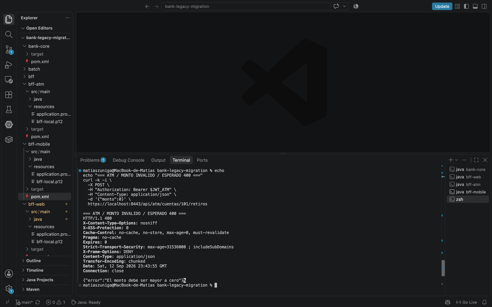
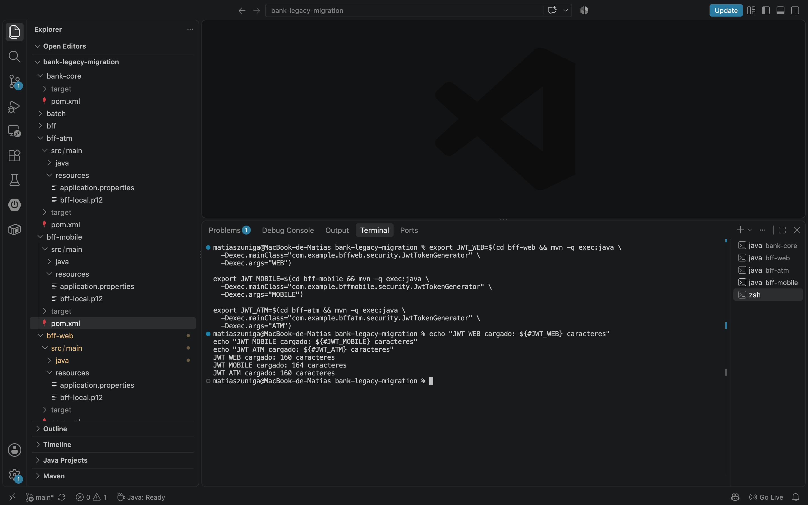

# Banco XYZ — Backend for Frontend (BFF)

Proyecto desarrollado para la asignatura **Desarrollo Backend III**, a partir del sistema de migración de datos legacy de Banco XYZ.

La solución implementa una arquitectura **Backend for Frontend (BFF)** con backends independientes para los canales **Web, Mobile y ATM**, permitiendo adaptar las respuestas, seguridad y operaciones a las necesidades particulares de cada cliente.

---

## 1. Objetivo

Implementar una estrategia Backend for Frontend para Banco XYZ que permita:

- disponer de un BFF independiente para Web;
- disponer de un BFF independiente para Mobile;
- disponer de un BFF independiente para ATM;
- adaptar los datos entregados según las necesidades de cada canal;
- reducir información innecesaria en clientes con requerimientos más acotados;
- implementar autenticación y autorización mediante JWT;
- restringir cada BFF al rol correspondiente a su canal;
- proteger los BFF mediante HTTPS;
- mantener la lógica de negocio y persistencia separada de la adaptación realizada por los BFF.

La arquitectura continúa el trabajo realizado durante las semanas anteriores, manteniendo además el procesamiento Batch como un componente independiente.

---

## 2. Arquitectura

La solución final está compuesta por cinco aplicaciones principales:

```text
                    ┌─────────────────────┐
Web ── HTTPS/JWT ──▶│       BFF Web       │ :8441
                    └──────────┬──────────┘
                               │
                    ┌──────────▼──────────┐
Mobile ─HTTPS/JWT──▶│     BFF Mobile      │ :8442
                    └──────────┬──────────┘
                               │
                    ┌──────────▼──────────┐
ATM ─── HTTPS/JWT ─▶│       BFF ATM       │ :8443
                    └──────────┬──────────┘
                               │
                               │ HTTP interno
                               ▼
                    ┌─────────────────────┐
                    │      Bank Core      │ :8080
                    │ negocio + JPA       │
                    └──────────┬──────────┘
                               │
                               ▼
                         PostgreSQL
```

Los tres BFF son aplicaciones Spring Boot independientes y no acceden directamente a PostgreSQL.

`bank-core` centraliza la lógica bancaria y el acceso a datos, mientras que cada BFF se concentra en adaptar la API a las necesidades de su canal.

El módulo `batch` permanece separado de la capa BFF y conserva la responsabilidad sobre los procesos Batch desarrollados durante las semanas anteriores.

---

## 3. Estructura del proyecto

```text
bank-legacy-migration/
│
├── batch/
│   └── procesos Spring Batch
│
├── bank-core/
│   └── lógica bancaria, persistencia JPA y API interna
│
├── bff-web/
│   └── Backend for Frontend para canal Web
│
├── bff-mobile/
│   └── Backend for Frontend para canal Mobile
│
├── bff-atm/
│   └── Backend for Frontend para canal ATM
│
├── database/
│   └── scripts asociados a PostgreSQL
│
├── data/
├── docs/
├── exploration/
│
├── evidencias_ejecucion/
│   └── evidencias de pruebas y ejecución
│
└── README.md
```

---

## 4. Responsabilidades por componente

### Bank Core

`bank-core` funciona como backend especializado y concentra:

- acceso a PostgreSQL mediante Spring Data JPA;
- consulta de cuentas;
- consulta de movimientos;
- lógica de retiros;
- actualización de saldos;
- registro persistente de retiros;
- manejo de errores asociados a operaciones bancarias.

Los BFF consumen esta API interna mediante HTTP y no contienen acceso directo a la base de datos.

### BFF Web

El canal Web entrega una representación más completa de la cuenta, adecuada para interfaces con mayor capacidad de visualización.

Incluye información como:

- identificador de cuenta;
- titular;
- edad;
- tipo de cuenta;
- saldo;
- interés generado;
- movimientos y sus descripciones.

### BFF Mobile

El canal Mobile reduce la cantidad de información enviada al cliente.

Entrega principalmente:

- identificador de cuenta;
- saldo;
- últimos movimientos.

Para disminuir el payload, la respuesta limita la información de movimientos a los datos esenciales requeridos por el cliente móvil.

### BFF ATM

El canal ATM utiliza respuestas mínimas orientadas a operaciones críticas.

Permite:

- consultar saldo disponible;
- realizar retiros.

La lógica bancaria del retiro permanece en `bank-core`; el BFF ATM se encarga de exponer y adaptar la operación para este canal.

---

## 5. Optimización por canal

La estrategia BFF permite entregar representaciones diferentes de una misma cuenta según las necesidades del cliente.

Durante las pruebas locales se obtuvieron los siguientes tamaños de respuesta:

| Canal | HTTP | Tamaño de respuesta |
|---|---:|---:|
| Web | 200 | 294 bytes |
| Mobile | 200 | 133 bytes |
| ATM | 200 | 42 bytes |

En la ejecución registrada:

- Mobile redujo aproximadamente un **55 %** el tamaño respecto de Web.
- ATM redujo aproximadamente un **86 %** el tamaño respecto de Web.
- ATM redujo aproximadamente un **68 %** el tamaño respecto de Mobile.

Los tiempos observados durante una ejecución local fueron:

| Canal | Tiempo observado |
|---|---:|
| Web | 0.078947 s |
| Mobile | 0.050789 s |
| ATM | 0.029518 s |

Estos tiempos corresponden a una ejecución local y pueden variar entre ejecuciones. La diferencia de tamaño, en cambio, responde directamente al diseño de los DTO específicos de cada BFF.



---

## 6. Seguridad

### HTTPS

Los tres BFF exponen sus APIs mediante HTTPS:

```text
Web     https://localhost:8441
Mobile  https://localhost:8442
ATM     https://localhost:8443
```

Para el entorno académico/local se utiliza un certificado autofirmado en formato PKCS12.

El certificado permite probar comunicación mediante TLS en los tres BFF. Al tratarse de un certificado autofirmado, herramientas como Postman o `curl` deben aceptar explícitamente el certificado local.

En `curl`, las pruebas locales utilizan la opción:

```bash
-k
```

> El certificado y su configuración corresponden exclusivamente al entorno de desarrollo académico. En un entorno productivo se deben utilizar certificados emitidos y administrados mediante mecanismos apropiados para producción.

### JWT

La autenticación se implementa mediante JSON Web Tokens (JWT) firmados con HS256.

Cada token contiene un rol asociado al canal:

```text
ROLE_WEB
ROLE_MOBILE
ROLE_ATM
```

Cada BFF autoriza exclusivamente el rol correspondiente.

La matriz esperada es:

| Solicitud | Resultado |
|---|---:|
| Token correspondiente al canal | `200 OK` |
| Sin token o token inválido | `401 Unauthorized` |
| Token válido de otro canal | `403 Forbidden` |

Por ejemplo:

```text
JWT WEB    → BFF Web    → 200
sin JWT    → BFF Web    → 401
JWT ATM    → BFF Web    → 403

JWT MOBILE → BFF Mobile → 200
JWT WEB    → BFF Mobile → 403

JWT ATM    → BFF ATM    → 200
```

La siguiente evidencia muestra autenticación y autorización en el canal Web:



En Mobile se verifica además que un JWT válido perteneciente a otro canal obtiene `403 Forbidden`:



---

## 7. Endpoints

### Web

#### Consultar cuenta

```http
GET /api/web/cuentas/{cuentaId}
```

Ejemplo:

```text
https://localhost:8441/api/web/cuentas/101
```

Requiere:

```text
ROLE_WEB
```

---

### Mobile

#### Consultar cuenta

```http
GET /api/mobile/cuentas/{cuentaId}
```

Ejemplo:

```text
https://localhost:8442/api/mobile/cuentas/101
```

Requiere:

```text
ROLE_MOBILE
```

---

### ATM

#### Consultar saldo

```http
GET /api/atm/cuentas/{cuentaId}/saldo
```

Ejemplo:

```text
https://localhost:8443/api/atm/cuentas/101/saldo
```

#### Realizar retiro

```http
POST /api/atm/cuentas/{cuentaId}/retiros
```

Ejemplo de body:

```json
{
  "monto": 10
}
```

Requiere:

```text
ROLE_ATM
```

La ejecución de una consulta de saldo y un retiro válido se encuentra documentada en:



---

## 8. Validación de operaciones ATM

Las solicitudes de retiro utilizan Jakarta Validation antes de enviar la operación a Bank Core.

Ejemplos de validación:

```json
{
  "monto": 0
}
```

produce:

```text
400 Bad Request
```

con:

```json
{
  "error": "El monto debe ser mayor a cero"
}
```

También se manejan respuestas asociadas a situaciones como:

- cuenta inexistente;
- saldo insuficiente;
- monto inválido.

Evidencia de validación:



---

## 9. Requisitos para ejecución

Para ejecutar el proyecto localmente se requiere:

- Java 17;
- Maven;
- PostgreSQL;
- base de datos `bank_legacy` configurada;
- puertos `8080`, `8441`, `8442` y `8443` disponibles.

---

## 10. Ejecución

Las aplicaciones deben ejecutarse en terminales independientes.

### 10.1 Bank Core

```bash
cd bank-core
mvn spring-boot:run
```

Disponible en:

```text
http://localhost:8080
```

### 10.2 BFF Web

```bash
cd bff-web
mvn spring-boot:run
```

Disponible en:

```text
https://localhost:8441
```

### 10.3 BFF Mobile

```bash
cd bff-mobile
mvn spring-boot:run
```

Disponible en:

```text
https://localhost:8442
```

### 10.4 BFF ATM

```bash
cd bff-atm
mvn spring-boot:run
```

Disponible en:

```text
https://localhost:8443
```

---

## 11. Generación de tokens para pruebas

Para las pruebas locales se incluyen generadores de JWT asociados a cada BFF.

Desde la raíz del proyecto se pueden cargar tokens temporales como variables de entorno:

```bash
export JWT_WEB=$(cd bff-web && mvn -q exec:java \
  -Dexec.mainClass="com.example.bffweb.security.JwtTokenGenerator" \
  -Dexec.args="WEB")

export JWT_MOBILE=$(cd bff-mobile && mvn -q exec:java \
  -Dexec.mainClass="com.example.bffmobile.security.JwtTokenGenerator" \
  -Dexec.args="MOBILE")

export JWT_ATM=$(cd bff-atm && mvn -q exec:java \
  -Dexec.mainClass="com.example.bffatm.security.JwtTokenGenerator" \
  -Dexec.args="ATM")
```

Se puede verificar que las variables fueron cargadas sin mostrar los tokens completos:

```bash
echo "JWT WEB cargado: ${#JWT_WEB} caracteres"
echo "JWT MOBILE cargado: ${#JWT_MOBILE} caracteres"
echo "JWT ATM cargado: ${#JWT_ATM} caracteres"
```

Los tokens utilizados para pruebas tienen una duración limitada.



---

## 12. Ejemplos de pruebas por terminal

### Web autorizado

```bash
curl -k -i \
  -H "Authorization: Bearer $JWT_WEB" \
  https://localhost:8441/api/web/cuentas/101
```

Resultado esperado:

```text
HTTP/1.1 200
```

### Web sin autenticación

```bash
curl -k -i \
  https://localhost:8441/api/web/cuentas/101
```

Resultado esperado:

```text
HTTP/1.1 401
```

### Web con token de otro canal

```bash
curl -k -i \
  -H "Authorization: Bearer $JWT_ATM" \
  https://localhost:8441/api/web/cuentas/101
```

Resultado esperado:

```text
HTTP/1.1 403
```

### ATM — retiro válido

```bash
curl -k -i \
  -X POST \
  -H "Authorization: Bearer $JWT_ATM" \
  -H "Content-Type: application/json" \
  -d '{"monto":10}' \
  https://localhost:8443/api/atm/cuentas/101/retiros
```

Resultado esperado:

```text
HTTP/1.1 200
```

---

## 13. Evidencias de ejecución

Las evidencias de Semana 5 se encuentran en:

```text
evidencias_ejecucion/
```

| Archivo | Validación |
|---|---|
| `01_tokens_jwt_por_canal.png` | Generación y carga de JWT para Web, Mobile y ATM |
| `02_web_https_autenticacion_autorizacion.png` | HTTPS Web, `200`, `401` y `403` |
| `03_mobile_https_autorizacion.png` | HTTPS Mobile, respuesta específica y autorización por canal |
| `04_atm_https_saldo_retiro.png` | Consulta de saldo y retiro válido mediante HTTPS |
| `05_atm_validacion_monto.png` | Validación de monto y respuesta `400` |
| `06_optimizacion_respuestas.png` | Comparación de tamaño y tiempo entre los tres BFF |

Las pruebas fueron realizadas manteniendo simultáneamente en ejecución `bank-core`, `bff-web`, `bff-mobile` y `bff-atm`.

---

## 14. Decisiones de diseño

### BFF independientes

Cada canal dispone de su propia aplicación Spring Boot.

Esto permite modificar, desplegar o escalar un BFF sin requerir que los otros canales compartan necesariamente el mismo ciclo de despliegue.

### Separación entre BFF y negocio

Los BFF no acceden directamente a PostgreSQL.

La persistencia y las reglas bancarias se encuentran centralizadas en `bank-core`, mientras que los BFF se concentran en:

- exposición de endpoints por canal;
- transformación de respuestas;
- DTO específicos;
- validación de entrada cuando corresponde;
- autenticación y autorización;
- comunicación con Bank Core.

### Respuestas específicas por canal

No se reutiliza una única representación para todos los clientes.

Web recibe una respuesta completa, Mobile una representación reducida y ATM únicamente la información necesaria para sus operaciones.

### Seguridad uniforme

Los tres BFF utilizan el mismo mecanismo general de autenticación mediante JWT y comunicación HTTPS, pero aplican autorización específica según el rol de cada canal.

---

## 15. Tecnologías utilizadas

- Java 17
- Spring Boot 3.5.10
- Spring Web
- Spring Security
- Spring Data JPA
- Jakarta Validation
- JWT / JJWT
- PostgreSQL
- Maven
- HTTPS / TLS
- Git y GitHub
- curl y Postman para pruebas

---

## 16. Estado final

La implementación contempla:

- [x] BFF independiente para Web
- [x] BFF independiente para Mobile
- [x] BFF independiente para ATM
- [x] respuestas adaptadas por canal
- [x] reducción de payload según necesidades del cliente
- [x] Bank Core separado de los BFF
- [x] persistencia mediante Spring Data JPA
- [x] validación de operaciones ATM
- [x] autenticación mediante JWT
- [x] autorización específica por canal
- [x] HTTPS en los tres BFF
- [x] certificado local para pruebas
- [x] evidencias de ejecución
- [x] medición comparativa de respuestas