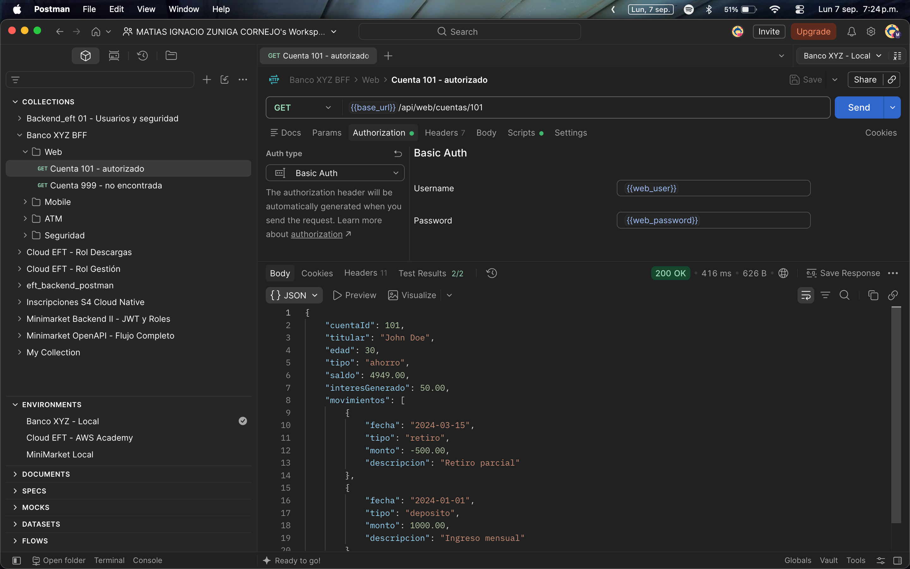
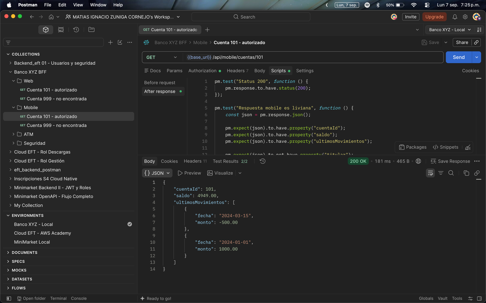
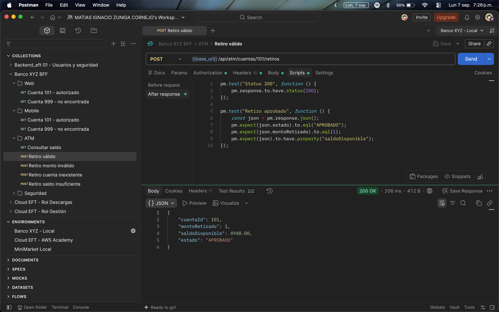
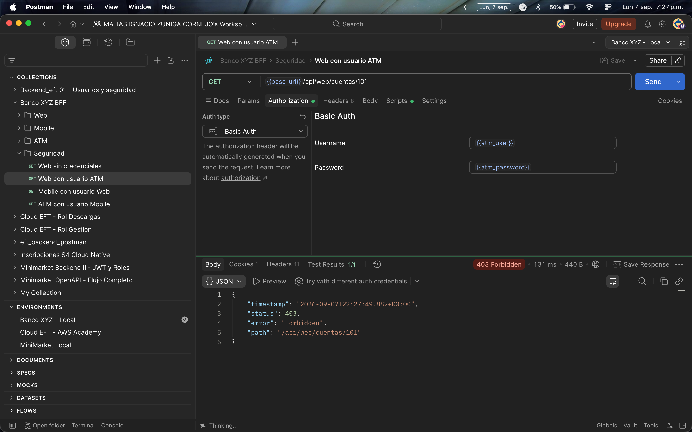
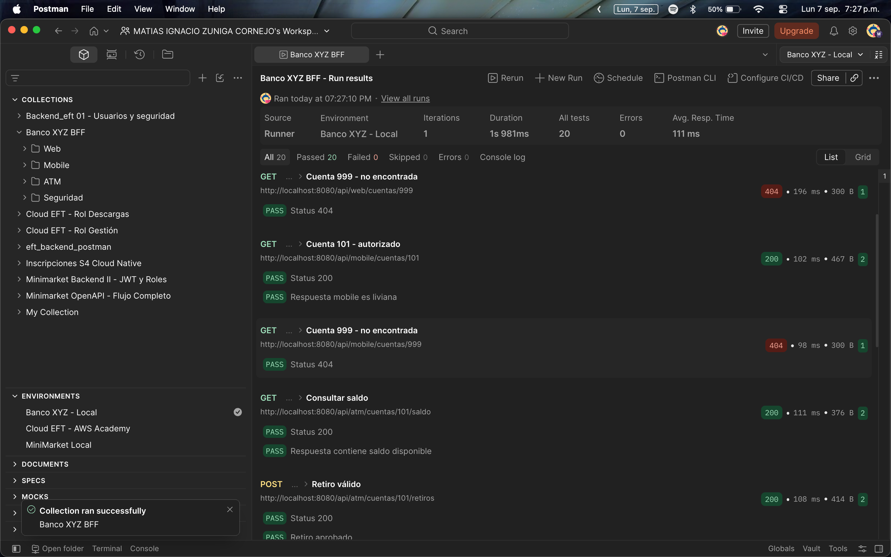

# Bank Legacy Migration - Semana 4

Proyecto desarrollado para **Desarrollo Backend III (PBY2203)** utilizando Java, Spring Boot y PostgreSQL.

El proyecto comenzó como una modernización de procesos batch del sistema legacy del Banco XYZ. Durante la Semana 4 se extiende la solución mediante el patrón **Backend for Frontend (BFF)**, implementando APIs diferenciadas para clientes Web, Mobile y ATM.

---

## Tecnologías

- Java 17
- Spring Boot 3
- Spring Batch
- Spring Web
- Spring Security
- PostgreSQL
- Maven
- Postman
- Git / GitHub

---

## Arquitectura BFF

Para Semana 4 se seleccionó una estrategia de **endpoints y capas específicas por frontend dentro de una aplicación Spring Boot compartida**.

Cada canal mantiene sus propios controllers, services y DTOs, mientras que el acceso a los datos se reutiliza mediante una capa común.

```text
                    PostgreSQL
                        │
                        ▼
                   BFF Common
                        │
             ┌──────────┼──────────┐
             ▼          ▼          ▼
          Web BFF   Mobile BFF   ATM BFF
```

Esta estrategia permite mantener separada la lógica específica de cada cliente sin duplicar innecesariamente el acceso a datos y la infraestructura del proyecto.

---

## BFF Web

El BFF Web está orientado a interfaces que requieren información completa.

```http
GET /api/web/cuentas/{cuentaId}
```

Entrega información de la cuenta, titular, saldo, interés generado y movimientos.



---

## BFF Mobile

El BFF Mobile entrega una respuesta reducida para disminuir la cantidad de información transferida.

```http
GET /api/mobile/cuentas/{cuentaId}
```

La respuesta contiene únicamente el identificador de cuenta, saldo y últimos movimientos con fecha y monto.

La batería Postman verifica además que la respuesta Mobile no incluya campos exclusivos del BFF Web.



---

## BFF ATM

El BFF ATM está orientado a operaciones bancarias específicas.

### Consulta de saldo

```http
GET /api/atm/cuentas/{cuentaId}/saldo
```

### Retiro

```http
POST /api/atm/cuentas/{cuentaId}/retiros
```

Ejemplo:

```json
{
  "monto": 100
}
```

Para ejecutar un retiro se valida la existencia de la cuenta, que el monto sea mayor que cero y que exista saldo suficiente.

Una operación aprobada actualiza el saldo y registra el retiro en `retiros_atm`. Ambas acciones se ejecutan dentro de una transacción mediante `@Transactional`.

| Caso | HTTP |
|---|---:|
| Operación correcta | 200 |
| Monto inválido | 400 |
| Cuenta inexistente | 404 |
| Saldo insuficiente | 409 |



---

## Seguridad por canal

Los BFF están protegidos mediante **Spring Security y HTTP Basic Authentication**.

```text
/api/web/**     → ROLE_WEB
/api/mobile/**  → ROLE_MOBILE
/api/atm/**     → ROLE_ATM
```

Credenciales utilizadas exclusivamente para esta actividad académica:

| Canal | Usuario | Contraseña |
|---|---|---|
| Web | `web_user` | `web_pass` |
| Mobile | `mobile_user` | `mobile_pass` |
| ATM | `atm_user` | `atm_pass` |

Un usuario autenticado no puede acceder a un BFF correspondiente a otro canal.



---

## Estructura principal

```text
bank-legacy-migration/
├── data/
├── database/
│   └── schema.sql
├── docs/
│   ├── propuesta-tecnica-s4.md
│   └── evidencias/
├── src/main/java/com/example/banklegacymigration/
│   ├── bff/
│   │   ├── atm/
│   │   ├── common/
│   │   ├── mobile/
│   │   ├── security/
│   │   └── web/
│   ├── config/
│   ├── interest/
│   ├── statement/
│   └── transaction/
├── src/main/resources/
│   └── application.properties
├── banco-xyz-bff.postman_collection.json
├── banco-xyz-local.postman_environment.json
└── pom.xml
```

Los paquetes `transaction`, `interest` y `statement` corresponden a los procesos Spring Batch desarrollados durante las semanas anteriores.

---

## Base de datos

El proyecto utiliza PostgreSQL con la base:

```text
bank_legacy
```

El esquema reproducible se encuentra en:

```text
database/schema.sql
```

Semana 4 incorpora la tabla `retiros_atm` para registrar los retiros realizados desde el BFF ATM.

Los tres canales utilizan una fuente de datos común. Por ejemplo, un retiro realizado desde ATM modifica `saldo_final`, por lo que el nuevo saldo puede ser consultado posteriormente desde Web, Mobile o ATM.

---

## Ejecución

### 1. Crear la base de datos

```bash
createdb bank_legacy
```

### 2. Crear las tablas

```bash
psql -d bank_legacy -f database/schema.sql
```

### 3. Compilar

```bash
mvn clean compile
```

### 4. Ejecutar las APIs

```bash
mvn spring-boot:run -Dspring-boot.run.arguments="--spring.batch.job.enabled=false"
```

La aplicación queda disponible en:

```text
http://localhost:8080
```

---

## Pruebas Postman

El repositorio incluye:

```text
banco-xyz-bff.postman_collection.json
banco-xyz-local.postman_environment.json
```

Para ejecutar las pruebas:

1. importar ambos archivos en Postman;
2. seleccionar el Environment `Banco XYZ - Local`;
3. iniciar la aplicación Spring Boot;
4. ejecutar la colección `Banco XYZ BFF`.

La batería valida los BFF Web, Mobile y ATM, casos de error y controles de autenticación y autorización.

### Resultado

```text
20 tests ejecutados
20 aprobados
0 fallidos
0 errores
```



---

## Continuidad del proyecto

La solución conserva las funcionalidades construidas previamente:

- **Semana 1:** procesamiento de transacciones, intereses y estados de cuenta mediante Spring Batch y PostgreSQL.
- **Semana 2:** manejo de excepciones, `skip`, `retry`, listeners y procesamiento por chunks.
- **Semana 3:** particionamiento, ejecución paralela, configuración externalizada e idempotencia.
- **Semana 4:** arquitectura BFF diferenciada para Web, Mobile y ATM, seguridad por canal y pruebas automatizadas de API.

Las versiones entregadas durante las semanas anteriores permanecen disponibles mediante el historial y los tags del repositorio Git.

---

## Propuesta técnica

La estrategia arquitectónica y las principales decisiones de implementación de Semana 4 se documentan en:

```text
docs/propuesta-tecnica-s4.md
```

---

## Resultado Semana 4

La implementación incorpora BFF diferenciados para Web, Mobile y ATM, una capa común de acceso a datos, seguridad específica por canal, retiros transaccionales, manejo de errores HTTP y una batería automatizada de 20 pruebas.