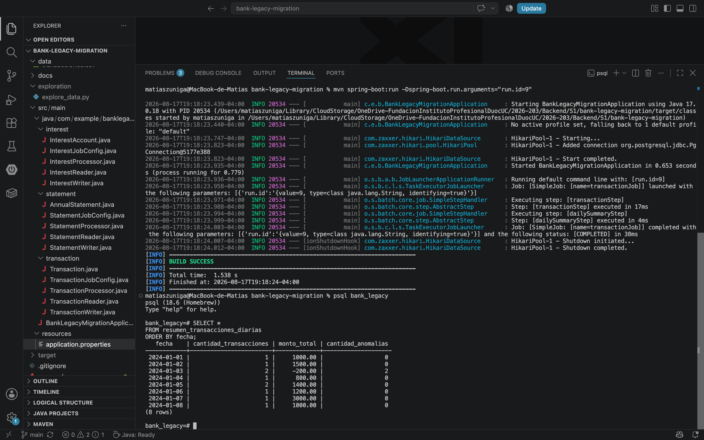
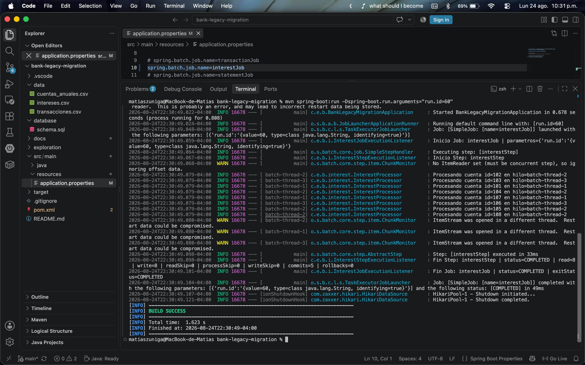
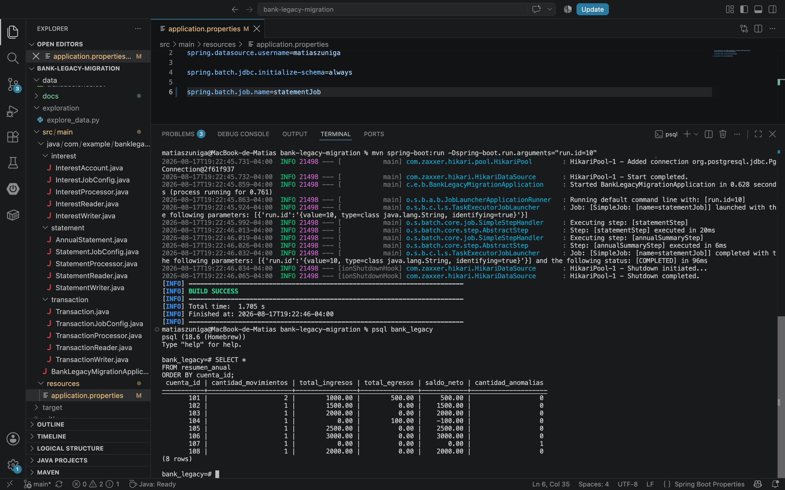

# Bank Legacy Migration

Proyecto desarrollado para la asignatura **Backend III**, cuyo objetivo es implementar una solución de procesamiento batch para migrar y transformar información proveniente de un sistema bancario legacy.

La solución utiliza **Spring Boot**, **Spring Batch** y **PostgreSQL**, organizando el procesamiento mediante Jobs independientes y una arquitectura basada en las responsabilidades de lectura, procesamiento y escritura.

## Tecnologías utilizadas

- Java 17
- Spring Boot
- Spring Batch
- Maven
- PostgreSQL
- Git / GitHub

## Estructura del proyecto

El proyecto implementa tres procesos batch independientes:

```text
src/main/java/com/example/banklegacymigration/
├── transaction/
│   ├── Transaction.java
│   ├── TransactionReader.java
│   ├── TransactionProcessor.java
│   ├── TransactionWriter.java
│   └── TransactionJobConfig.java
│
├── interest/
│   ├── InterestAccount.java
│   ├── InterestReader.java
│   ├── InterestProcessor.java
│   ├── InterestWriter.java
│   └── InterestJobConfig.java
│
├── statement/
│   ├── AnnualStatement.java
│   ├── StatementReader.java
│   ├── StatementProcessor.java
│   ├── StatementWriter.java
│   └── StatementJobConfig.java
│
└── BankLegacyMigrationApplication.java
```

Cada Job mantiene separadas las responsabilidades principales de Spring Batch:

```text
Reader → Processor → Writer
```

- **Reader:** obtiene los registros desde los archivos CSV legacy.
- **Processor:** aplica las reglas de transformación y detección de anomalías.
- **Writer:** persiste los registros procesados en PostgreSQL.
- **JobConfig:** configura y orquesta los Steps correspondientes a cada proceso.

## Jobs implementados

### Transaction Job

Procesa las transacciones bancarias diarias provenientes de `transacciones.csv`.

El proceso:

- Lee las transacciones desde el archivo CSV.
- Identifica registros anómalos.
- Persiste los resultados en PostgreSQL.
- Genera un resumen diario de transacciones mediante un segundo Step.

El resumen diario contiene la cantidad de transacciones, monto total y cantidad de anomalías por fecha.

### Interest Job

Procesa las cuentas contenidas en `intereses.csv` para realizar el cálculo de intereses.

Se utilizaron las siguientes tasas como supuesto de implementación:

- Ahorro: **1%**
- Préstamo: **2%**

Los tipos de cuenta no contemplados son almacenados como anomalías para mantener trazabilidad del registro.

El proceso calcula el interés correspondiente y el saldo final de cada cuenta antes de persistir los resultados.

### Statement Job

Procesa los movimientos contenidos en `cuentas_anuales.csv`.

El Job consta de dos Steps:

1. Procesamiento y persistencia de los movimientos individuales.
2. Generación de un resumen anual agrupado por cuenta.

El resumen incluye:

- Cantidad de movimientos.
- Total de ingresos.
- Total de egresos.
- Saldo neto.
- Cantidad de anomalías.

## Tratamiento de anomalías

Se utilizó un criterio simple orientado a conservar la información siempre que el registro pueda ser procesado.

Los registros válidos se almacenan normalmente, mientras que situaciones que requieren revisión se mantienen en la base de datos mediante los campos:

```text
anomalia
motivo
```

Esto permite conservar el registro original y, al mismo tiempo, identificar por qué fue considerado anómalo.

Los errores estructurales que impiden interpretar correctamente un registro pueden ser omitidos mediante la tolerancia a fallos configurada en Spring Batch.

## Persistencia e idempotencia

Los resultados procesados se almacenan en **PostgreSQL**.

Para permitir la reejecución de los Jobs sin duplicar información, los Writers utilizan las claves definidas en la base de datos junto con:

```sql
ON CONFLICT (...) DO NOTHING
```

De esta manera, la idempotencia se resuelve mediante las restricciones de la base de datos, sin incorporar mecanismos adicionales de hashing o deduplicación.

Para las tablas de resumen, que representan información derivada, se utiliza:

```sql
ON CONFLICT (...) DO UPDATE
```

Esto permite recalcular y actualizar los resultados cuando el Job vuelve a ejecutarse.

## Configuración

La conexión a PostgreSQL se encuentra definida en:

```text
src/main/resources/application.properties
```

El proyecto contiene tres Jobs. Antes de ejecutar la aplicación se debe descomentar **solo uno** en `application.properties`:

```properties
# spring.batch.job.name=transactionJob
# spring.batch.job.name=interestJob
# spring.batch.job.name=statementJob
```

Por ejemplo:

```properties
spring.batch.job.name=transactionJob
```

## Ejecución

Desde la raíz del proyecto:

```bash
mvn spring-boot:run
```

Para ejecutar una nueva instancia del Job durante pruebas se puede proporcionar un parámetro identificador:

```bash
mvn spring-boot:run -Dspring-boot.run.arguments="run.id=10"
```

Spring Batch registra la ejecución de cada Job y sus Steps en sus tablas de metadatos.

## Evidencias

Las evidencias de ejecución se encuentran en:

```text
docs/evidencias/
```

### Transaction Job



### Interest Job



### Statement Job



Cada evidencia muestra la ejecución satisfactoria del Job y los resultados persistidos en PostgreSQL.